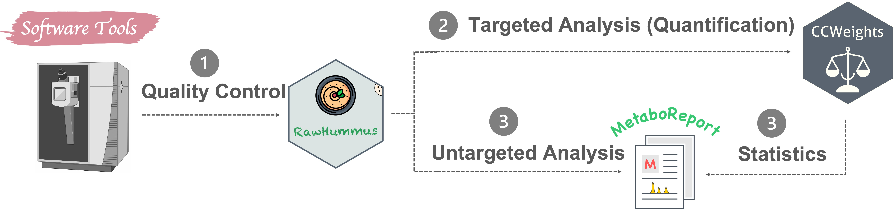

I have a broad interest in **analytical chemistry** and **chemoinformatics**, You can refer to my complete publication list from  [Google Scholar](https://scholar.google.com/citations?user=qbNRJIkAAAAJ&hl=en).

You are welcome to contact me.



## 1. Mass Spectrometry Imaging

### 1.1 Introduction

### 1.2 MSI Instrument

I am familiar with the following MSI instrument:

- Ultraflex II MALDI-TOF (Bruker) (1 year)

- SolariX (Bruker) (7+ years)

- RapifleX MALDI-TOF/TOF Tissuetyper (Bruker) (1 year)

- MALDI/DESI-Orbitrap (Prosolia-Thermo) (4 yars)

- MALDI2-Orbitrap (Spectroglyph-Thermo) (1+ year)

- DESI-TSQ (Waters) (1+ year)

### 1.3. Software

Apartfrom the vendor-dependent software such as FlexImaging, SCiLS Lab, ImageInsight, I have, particularly `Cardinal`, `MSI reader` and `MALDIQuant`

### 1.4. Representative publications

<u>**Dong, Y.**</u>, Sonawane, P., Cohen, H., Polturak, G., Feldberg, L., Avivi, S.H., Rogachev, I. and Aharoni, A., 2020. High mass resolution, spatial metabolite mapping enhances the current plant gene and pathway discovery toolbox. **New Phytologist**, 228(6), pp.1986-2002. <i class="fa fa-file-pdf-o" aria-hidden="true"></i> [PDF]()

<u>**Dong, Y.**</u>., Li, B. and Aharoni, A., 2016. More than pictures: when MS imaging meets histology. **Trends in plant science**, 21(8), pp.686-698. <i class="fa fa-file-pdf-o" aria-hidden="true"></i> [PDF]()

<u>**Dong, Y.**</u>, Li, B., Malitsky, S., Rogachev, I., Aharoni, A., Kaftan, F., Svatoš, A. and Franceschi, P., 2016. Sample preparation for mass spectrometry imaging of plant tissues: a review. **Frontiers in Plant Science**, 7, p.60. <i class="fa fa-file-pdf-o" aria-hidden="true"></i> [PDF]()

-----

## 2. Metabolomics/Lipidomics

### 2.1. Introduction

- My research interests include mass spectrometry imaging, metabolomics and chemoinformatics.

- While science is a big part of my life, in my spare time I love [jogging](/jogging), hiking and playing with cats.

- <i class="far fa-user"></i>: [CV](/CV/YDong.pdf)

- <i class="fa fa-github" aria-hidden="true"></i>: [Github](https://github.com/yonghuidong)

- <i class="fa fa-twitter" aria-hidden="true"></i>: [Twitter](https://twitter.com/YH_Dong)

### 2.2. LCMS Instrument

I am familiar with the following MSI instrument:

- Orbitrap (Thermo) (4 year)

- Orbitrap (2 years)

- RapifleX MALDI-TOF/TOF Tissuetyper (Bruker) (1 year)

- MALDI/DESI-Orbitrap (Prosolia-Thermo) (4 yars)

- MALDI2-Orbitrap (Spectroglyph-Thermo) (1+ year)

- DESI-TSQ (Waters) (1+ year)

### 2.3 Software

### 2.4 Representative publications

-----

## 3. Stable Isotope Labeling

### 3.4 Representative Publications

<u>**Dong, Y.**</u>, Feldberg, L., Rogachev, I. and Aharoni, A., 2021. Characterization of the PRODUCTION of ANTHOCYANIN PIGMENT 1 Arabidopsis dominant mutant using DLEMMA dual isotope labeling approach. **Phytochemistry**, 186, p.112740. <i class="fa fa-file-pdf-o" aria-hidden="true"></i> [PDF]()

<u>**Dong, Y.**</u>, Feldberg, L. and Aharoni, A., 2019. Miso: an R package for multiple isotope labeling assisted metabolomics data analysis. **Bioinformatics**, 35(18), pp.3524-3526. <i class="fa fa-file-pdf-o" aria-hidden="true"></i> [PDF]()

Feldberg, L., <u>**Dong, Y.**</u> **(co-first author)**, Heinig, U., Rogachev, I. and Aharoni, A., 2018. DLEMMA-MS-imaging for identification of spatially localized metabolites and metabolic network map reconstruction. **Analytical chemistry**, 90(17), pp.10231-10238. <i class="fa fa-file-pdf-o" aria-hidden="true"></i> [PDF]()

-----

## 4. Chemoinformatics

I mainly use **R** and **Python**

### 4.2 My Software

- **MSbox** : A series of common mass spectrometry tools. It allows checking element isotopes, calculating (isotope labelled) exact monoisitopic mass, m/z values and mass accuracy, and inspecting possible contaminant mass peaks, examining possible adducts in electrospray ionization (ESI) and Matrix-Assisted Laser Desorption Ionization (MALDI) ion sources. <i class="fa fa-github" aria-hidden="true"></i> [GitHub](https://github.com/YonghuiDong/MSbox)

- **Miso**: An efficient tool for fishing out labeled molecules from single, dual or multiple isotope labeling experiment. <i class="fa fa-github" aria-hidden="true"></i> [GitHub](https://github.com/YonghuiDong/Miso).

- **CCWeights** The accuracy of any analytical method highly depends on the selection of an appropriate calibration model. CCWeights is designed to automatically assess & select the best weighting factors (WF) for accurate metabolite quantification using the linear calibration curve. <i class="fa fa-github" aria-hidden="true"></i> [GitHub](https://github.com/YonghuiDong/CCWeights).

 - **RawHummus** Robust and reproducible data is essential to ensure high-quality results for metabolomics studies where detector sensitivity drifts, retention time, and mass accuracy shifts frequently occur. RawHummus is designed to automatically detect measurement bias &  verify system consistency. <i class="fa fa-github" aria-hidden="true"></i> [GitHub](https://github.com/YonghuiDong/RawHummus).

### 4.4 Representative publications

<u>**Dong, Y.**</u>, Kazachkova, Y., Gou, M., Morgan, L., Wachsman, T., Gazit, E. and Birkler, R.I.D., 2022. RawHummus: an R Shiny app for automated raw data quality control in metabolomics. **Bioinformatics**, 38(7), pp.2072-2074. <i class="fa fa-file-pdf-o" aria-hidden="true"></i> [PDF]()

<u>**Dong, Y.**</u>, Wachsman, T., Morgan, L., Gazit, E. and Birkler, R.I.D., 2021. CCWeights: an R package and web application for automated evaluation and selection of weighting factors for accurate quantification using linear calibration curve. **Bioinformatics Advances**, 1(1), p.vbab029. <i class="fa fa-file-pdf-o" aria-hidden="true"></i> [PDF]()

<u>**Dong, Y.**</u>, Feldberg, L. and Aharoni, A., 2019. Miso: an R package for multiple isotope labeling assisted metabolomics data analysis. **Bioinformatics**, 35(18), pp.3524-3526. <i class="fa fa-file-pdf-o" aria-hidden="true"></i> [PDF]()

